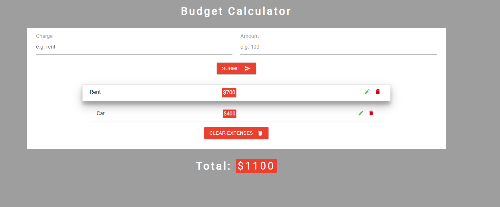

# Budget Calculator
## Description: 
The App for calculating personal expenses. 

## The outcome: 

## The Stack: 
The app built with **React.js** and use browser's local storage. I was using functional components alonge with `setState()` and `setEffect()` hooks.

## The version: 
Completed

## The online demo: 
[**DEMO**](https://frosty-hugle-7d6c1c.netlify.app/)

